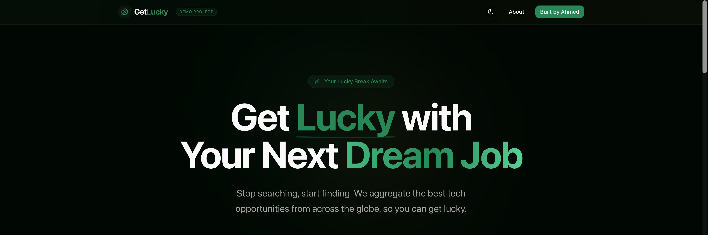

# 🍀 GetLucky - Public Demo

**The Serendipity Engine for Job Hunters.**
> "Luck is what happens when preparation meets opportunity." — Seneca



**GetLucky** is a modern, privacy-first job aggregator designed to democratize search. This is a **Public Demo** showcasing advanced scraping reliability, AI analysis, and strict GDPR compliance.

## ✨ Features

### 🛡️ 100% GDPR Compliant (The "Ghost" Protocol)
We take privacy seriously. This demo implements **advanced data minimization**:
-   **Ephemeral Daily IDs**: IP addresses are hashed with a salt + the current date (`SHA256(IP + Date + Salt)`).
-   **No History**: User IDs rotate every 24 hours. Usage history cannot be tracked across days.
-   **Auto-Cleanup**: A background "Janitor" process randomly (10% chance) deletes all non-current data.
-   **Zero Cookies**: No tracking cookies, no analytics pixels.

### 🤖 AI-Powered Intelligence
Powered by **Google Gemini 1.5 Flash**:
-   **Skill Extraction**: Automatically detects tech stack (React, Node.js, Python).
-   **Seniority Analysis**: Infers role level (Junior, Mid, Senior).
-   **Visa Sponsorship**: Detects sponsorship availability in job descriptions.

### ⚡ Reliability Engine (Scraping)
Built with **Playwright**, featuring:
-   **Stealth Mode**: Automated barriers evasion.
-   **Multi-Region**: Supports Germany 🇩🇪, UK 🇬🇧, USA 🇺🇸, Canada 🇨🇦, Japan 🇯🇵.
-   **Sources**: Aggregates from public listings (LinkedIn, etc.).

## 🛠️ Tech Stack

-   **Framework**: [Next.js 15](https://nextjs.org/) (App Router)
-   **AI**: [Google Gemini 1.5 Flash](https://deepmind.google/technologies/gemini/)
-   **Database**: [Prisma](https://www.prisma.io/) + SQLite (Dev) / Postgres (Prod)
-   **Scraping**: [Playwright](https://playwright.dev/)
-   **Styling**: [Tailwind CSS](https://tailwindcss.com/) + `shadcn/ui`
-   **Rate Limiting**: Custom Ephemeral Token Bucket

## 🚀 Getting Started

1.  **Clone the repository**:
    ```bash
    git clone https://github.com/ahmedmaaloul/getlucky.git
    cd getlucky
    ```

2.  **Install dependencies**:
    ```bash
    npm install
    npx playwright install chromium
    ```

3.  **Setup Environment**:
    Copy `.env.example` to `.env`:
    ```bash
    cp .env.example .env
    ```
    *You need a `GEMINI_API_KEY` from Google AI Studio.*

4.  **Run the App**:
    ```bash
    npm run dev
    ```

## 📜 License

MIT License. Built with ❤️ by [Ahmed Maaloul](https://github.com/ahmedmaaloul).
